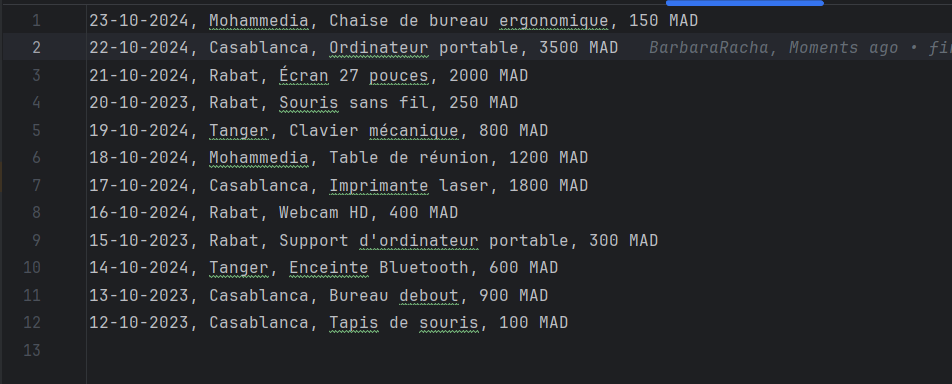
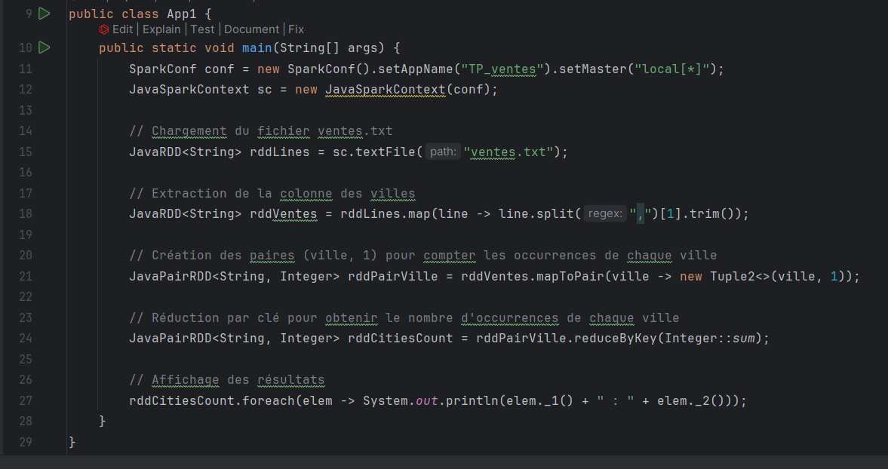
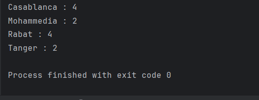
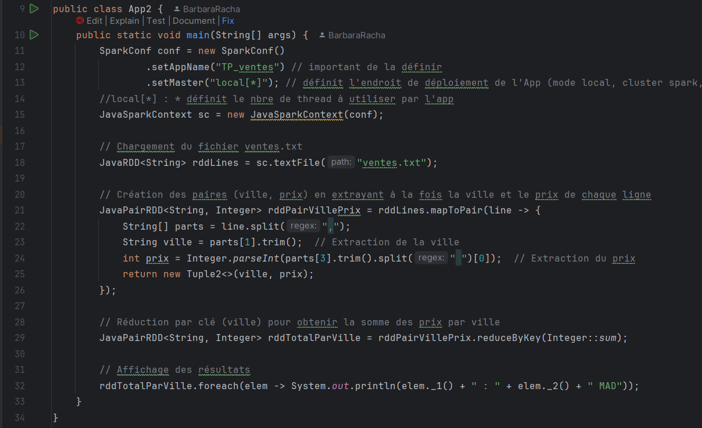
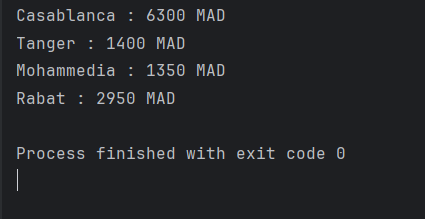

<h1 align="center"> TP3: Programmation des RDDs - Spark Core</h1>

 

<h2>1. On souhaite développer une application Spark permettant, à partir d’un fichier texte (ventes.txt) en entré, contenant les ventes d’une entreprise dans les différentes villes, de Déterminer le total des ventes par ville.
 
  
<h2>La structure du fichier ventes.txt est de la forme suivante : "date ville produit prix" </h2>

<h2>Code: </h2>
  
  
<h2>Sortie: </h2>
  

<h2> 2. Vous créez une deuxième application permettant de calculer le prix total des ventes des produits par ville </h2>
<h2>Code: </h2>
  
<h2>Sortie: </h2>
  
